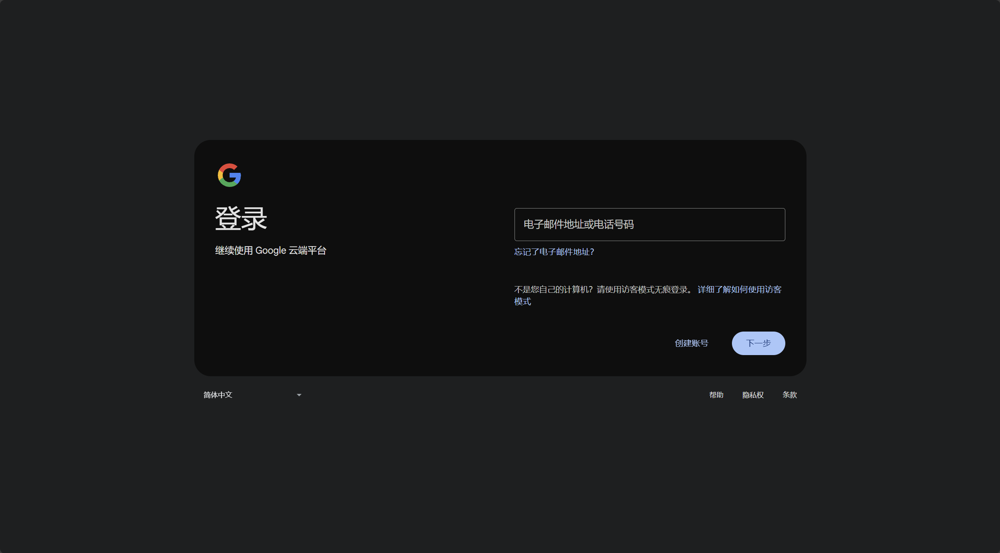
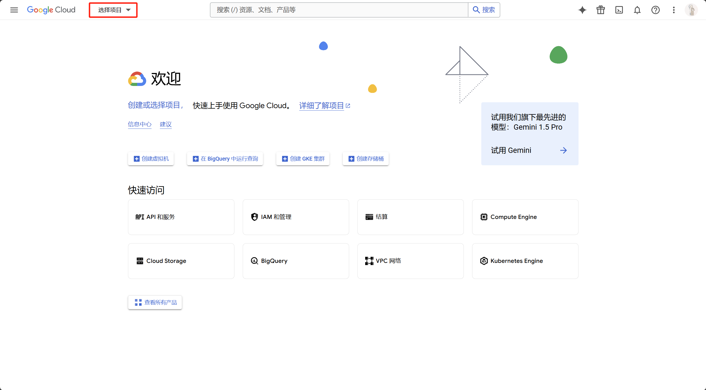
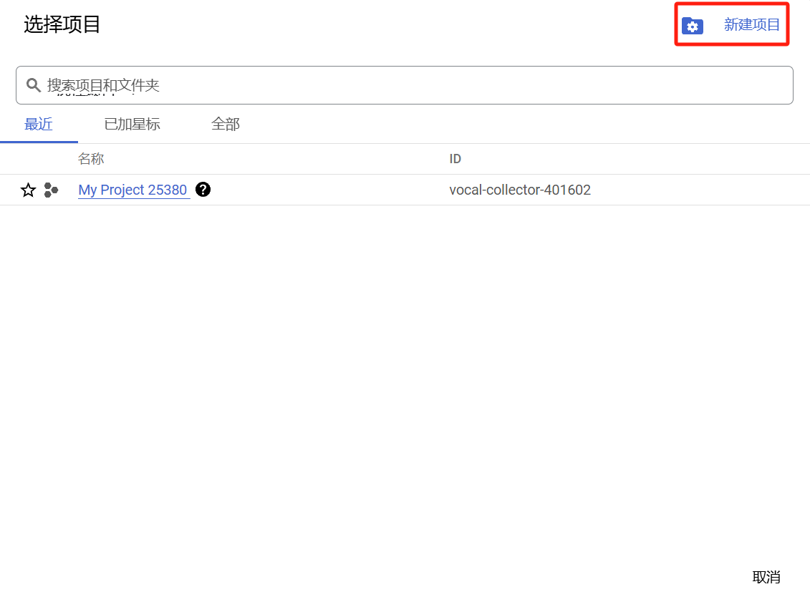
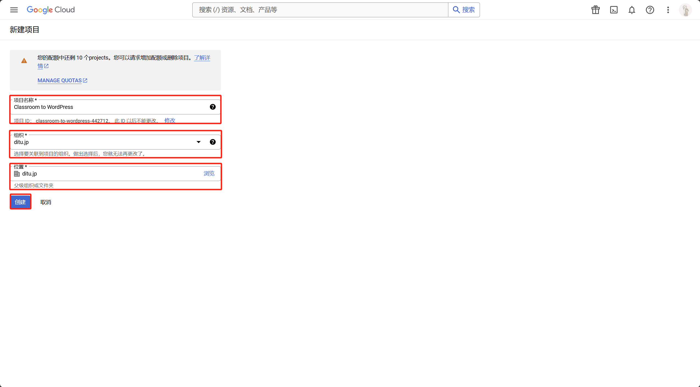

# Classroom to WordPress

**贡献者：** NI YUNHAO  
**捐赠链接：** [https://21te495.edu2web.com/](https://21te495.edu2web.com/)   
**标签：** Google Classroom，学生成绩，教育  
**最低要求：** WordPress 5.0  
**测试通过版本：** WordPress 6.3  
**最低 PHP 版本要求：** 7.4  
**稳定版本：** 1.3  
**许可证：** GPLv2 或更高版本  
**许可证链接：** [http://www.gnu.org/licenses/gpl-2.0.html](http://www.gnu.org/licenses/gpl-2.0.html)  

Classroom to WordPress 插件将 Google Classroom 与 WordPress 无缝连接，可以获取学生数据、作业和成绩，并将其发布到 WordPress。

## 插件简介

**Classroom to WordPress** 插件可以帮助教师和学生整合 Google Classroom 数据至 WordPress，以实现自己的数据自己管理。主要功能包括：

### 学生

- 获取并列出 Google Classroom 中的所有课程。

- 获取课程中自己的作业和成绩，自动将课程数据、作业或成绩发布为 WordPress 文章。

### 教师

- 获取并列出 Google Classroom 中的所有课程。

- 查看课程中学生的详细名单。

- 获取单个学生或整班学生的作业和成绩，自动将课程数据、作业或成绩发布为 WordPress 文章。

这款插件特别适合希望能自己的学习数据自己管理的人，把学习数据数据去中心化。

## 功能特色

- **Google Classroom API 集成**：轻松完成身份验证并获取 Google Classroom 数据。

- **课程管理**：列出所有课程并查看详情。

- **学生管理**：展示学生名单及其电子邮件和个人资料。

- **作业与成绩获取**：获取学生提交的作业及其成绩。

- **文章自动创建**：将学生数据直接发布为 WordPress 文章。

- **角色识别**：根据用户角色（教师或学生）调整功能权限。

## 安装步骤

1.点击页面右侧的绿色按钮 “Code”。  

2.在下拉菜单中选择 “Download ZIP” 下载插件的压缩文件。 

3.登录到您的 WordPress 管理后台。 

4.在左侧菜单中点击 插件 > 安装插件。

5.在页面左上角点击 上传插件 按钮。 

6.点击 选择文件，选择刚刚从 GitHub 下载的 ZIP 文件，然后点击 现在安装。  

7.安装完成后，点击 启用插件 按钮。

8.插件安装成功后，您可以在左侧菜单找到 “Classroom Grades to WP”，并开始配置和使用插件。  

## 配置步骤

1. 在 [Google API 控制台](https://console.cloud.google.com/) 中设置 OAuth 2.0 客户端后，获取Json文件。

2. 打开Json文件并复制文件内容。

3. 在插件设置页面将复制内容粘贴到输入框中，然后点击 保存token.json。

5. 点击 **“授权 Google Classroom”** 按钮授予必要权限。

6. 授权完成后，即可通过插件界面访问课程数据、作业和成绩。

## 如何获取 `json` 文件？

### 登录 Google Cloud Console

1. 打开 [Google Cloud Console](https://console.cloud.google.com/) 。

2. 使用您的 Google 账号登录。
 

### 创建新项目

1. 在顶部导航栏点击 “选择项目”。

2. 点击 “新建项目”。

3. 输入项目名称（如 Classroom to WordPress），选择适当的组织和位置（如 ditu.jp），点击 “创建”。

### 启用 Google Classroom API

1.在项目创建后，点击通知内容。

1.点击左侧产品中的 “API 和服务”。
1.点击左侧菜单中的 “库”。
1.在搜索框中输入 “Google Classroom API”，按下回车。
1.选择 “Google Classroom API”，
1.点击 “启用”（启用）。
1.等待 API 启用完成，页面会自动跳转到 API 的详细信息页面。

### 创建 OAuth 同意屏幕

在左侧菜单中，点击 “API とサービス” > “認証情報”（API 和服务 > 凭据）。
点击页面顶部的 “同意画面を構成”（配置同意屏幕）。
根据您的需求选择 “外部”（外部用户）或 “内部”（仅组织内部用户）。一般情况下选择 外部。
点击 “作成” 进入下一步：
アプリ名（应用名称）：输入您的应用名称，例如 Classroom to WordPress。
サポートメールアドレス（支持电子邮件）：填写您的邮箱地址。
アプリのドメイン（应用域名）：可选，若您的应用有域名可填写。
開発者の連絡先情報（开发者联系方式）：输入邮箱地址，完成后点击 “保存して次へ”（保存并继续）。
スコープの追加（添加作用域）：点击 スコープを追加，确保添加以下作用域：
https://www.googleapis.com/auth/classroom.courses
https://www.googleapis.com/auth/classroom.rosters
https://www.googleapis.com/auth/classroom.coursework.students
点击 “保存して次へ”，完成同意屏幕设置。

### 创建 OAuth 2.0 凭据

返回 “認証情報”（凭据）页面。
点击 “認証情報を作成”（创建凭据） > “OAuth クライアント ID”。
在 アプリケーションの種類（应用类型） 中，选择 ウェブアプリケーション（Web 应用）。
输入应用名称（如 Classroom to WordPress）。
在 承認済みのリダイレクト URI（已授权重定向 URI） 中添加以下 URI：
示例：https://www.example.com/wp-admin/admin-post.php?action=google_classroom_auth
点击 “作成”（创建）。

### 下载 JSON 文件

创建完成后，系统会生成 客户端 ID 和 客户端密钥。
点击 “ダウンロード” 按钮，将 JSON 文件下载到本地（通常命名为 client_secret_XXXX.json）。
将此文件保存好，以便在 WordPress 插件中上传或配置。

## 插件截图

1. **插件设置页面**：展示插件设置和选项概览。
2. **课程列表**：显示从 Google Classroom 获取的课程。
3. **学生成绩表**：展示作业和成绩的详细表格。
4. **WordPress 文章展示**：插件自动生成的学生成绩 WordPress 文章示例。

## 更新日志

### 1.3
- 新增支持显示作业附件和教师附件功能。
- 改进了 Google API 响应的错误处理。
- 增强用户角色（教师或学生）检测和权限管理。

### 1.2
- 添加自动创建学生成绩和数据的 WordPress 文章功能。
- 优化 `token.json` 管理界面。

### 1.1
- 发布首个版本，提供 Google Classroom 的基本认证功能。

## 升级注意事项

升级前请确保 `token.json` 文件已正确配置，以避免功能中断。

## 许可证

本插件遵循 GNU 通用公共许可证 (GPLv2 或更高版本)。  
详情请参考 [GPLv2 许可证](http://www.gnu.org/licenses/gpl-2.0.html)。

## 技术支持

**如需技术支持或有任何问题，请联系：** NI YUNHAO  
**邮箱：** 21TE495@ditu.jp
